# interlock_pycharm
## Pycharm(IDE) 와  github 연동해서 편하게 쓰자

1. 깃에서 새로운 repository를 생성하고 얻은 https url 를 Pycharm(IDE)에 입력해준다.
2. 이후 해당 repository의 폴더가 만들어지게 되는 [파일 생성/수정] > [commit] > [push] 단계를 거치면 깃에 자동으로 반영이된다.

#### 아래 위 과정을 사진으로 설명으로 자세히 설명하겠다.

#### 1. 저장소 생성
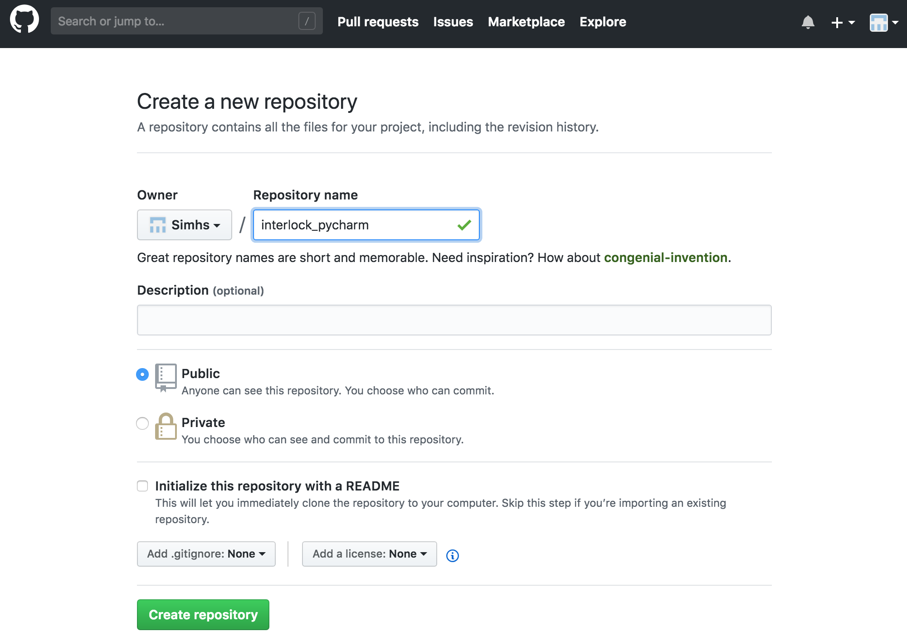

#### 2. HTTPS URL 복사
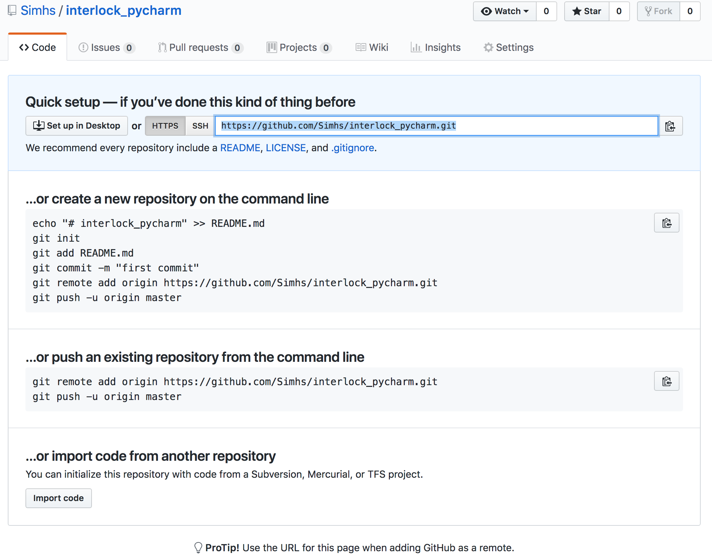

#### 3. Pycharm의 Git에 링크를 붙여넣기 후 디렉토리 생성
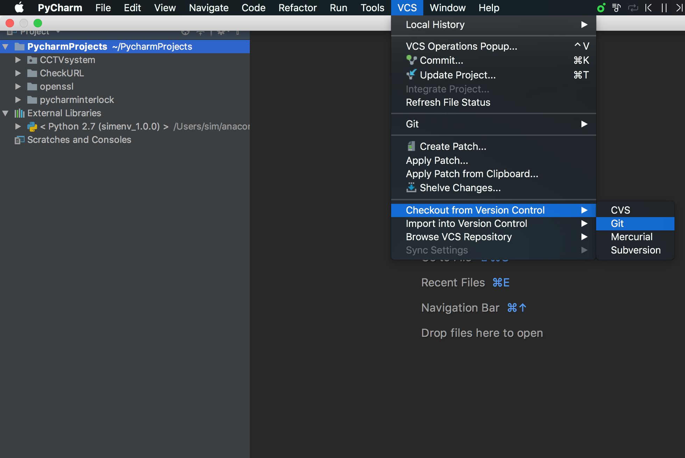
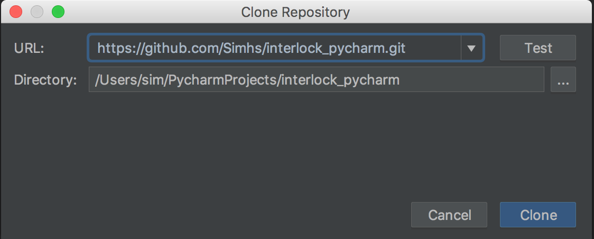
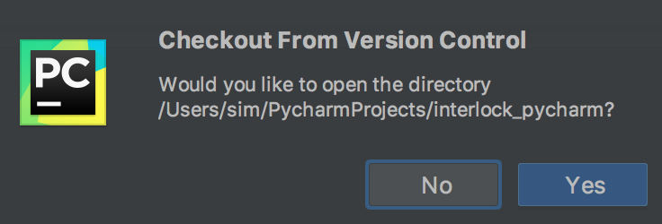

#### 4. README.md와 test.py 생성
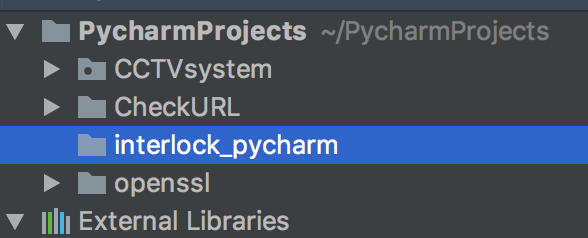
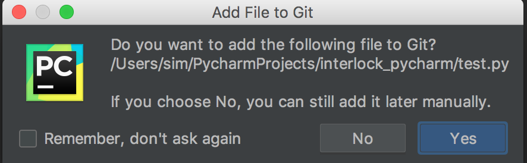
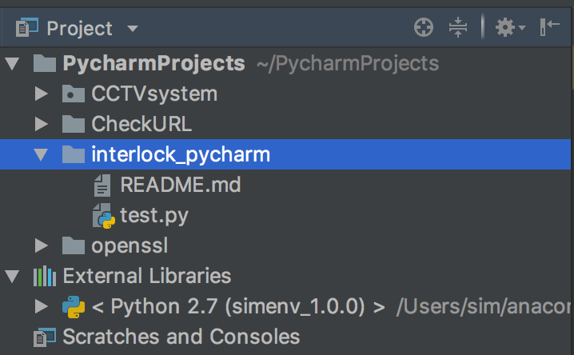

#### 5. commit
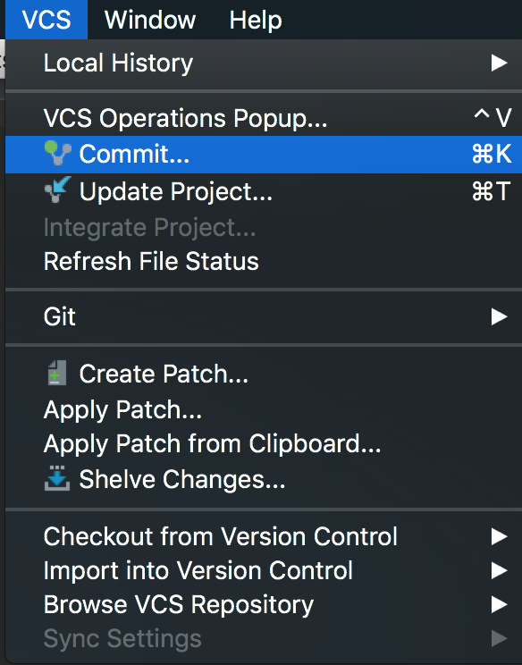
#### 6. 커밋 내용들을 확인하고 최종 push
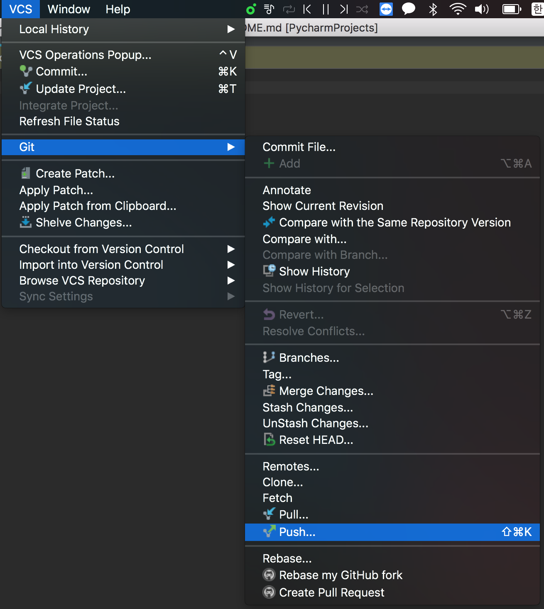
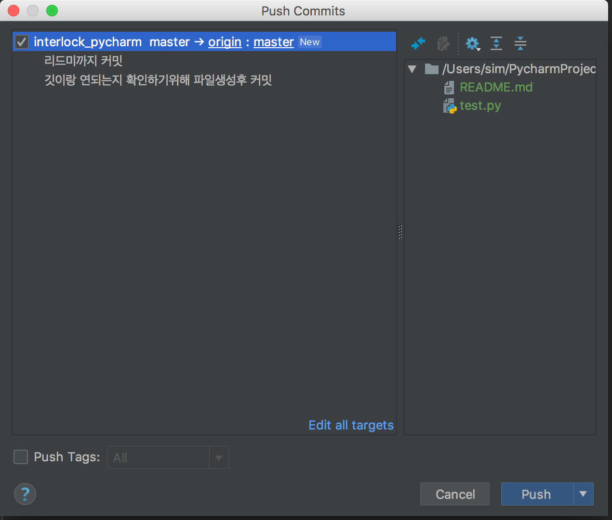
#### 7. 연동성공 
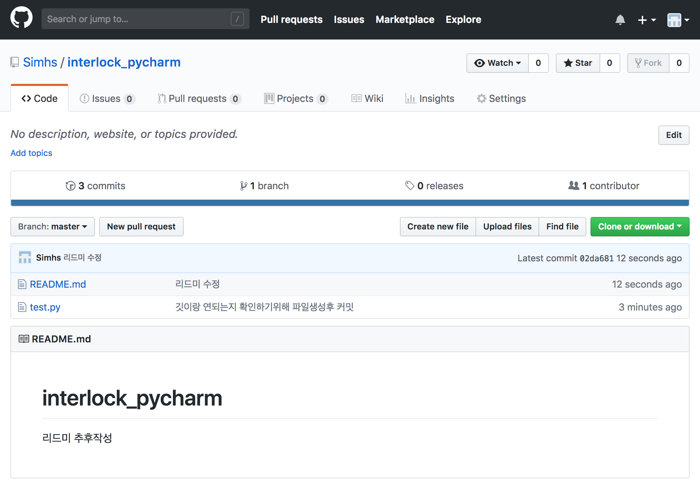
